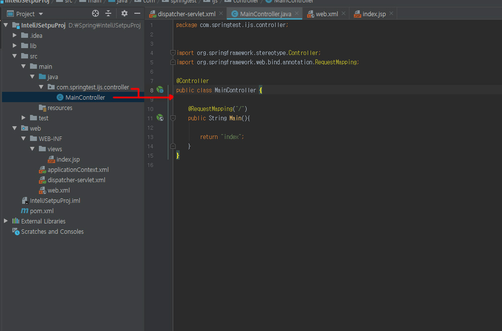

# InteliJ

## 목차
1. InteliJ Spring Mvc Setting. [link](#Spring-MVC-Setting)
1. 자주쓰는 Mavne [Spring Repository Link](#Spring-MVC-Setting)
1. 자주쓰는 설정파일 [Spring Repository Link](#Spring-MVC-Setting)
1. 사용 플러그인  [link](#plug-In)


<br>
<br>
<hr>

### Spring MVC Setting

1. Spring mvc로 프로젝트 생성
2. 프로젝트 오른쪽클릭 - add Fremework - Maven 추가  [자주쓰는 Maven link]()

3. Spring 라이브러리 추가해주기 `Maven` 


4. WEB.xml 설정해주기 [web.xml]()


4. Dispatcher-servlet.xml 수정 [Dispatcher-servlet.xml]()

`Dispatcher-servlet.xml`


```
<?xml version="1.0" encoding="UTF-8"?>
<beans xmlns="http://www.springframework.org/schema/beans"
       xmlns:xsi="http://www.w3.org/2001/XMLSchema-instance"
       xmlns:context="http://www.springframework.org/schema/context"
       xmlns:mvc="http://www.springframework.org/schema/mvc"
       xsi:schemaLocation="http://www.springframework.org/schema/beans http://www.springframework.org/schema/beans/spring-beans.xsd
        http://www.springframework.org/schema/context http://www.springframework.org/schema/context/spring-context-4.0.xsd
        http://www.springframework.org/schema/mvc http://www.springframework.org/schema/mvc/spring-mvc-4.0.xsd">


<mvc:annotation-driven></mvc:annotation-driven> <!-- Annotation 활성화 -->
    <context:component-scan base-package="Controller"></context:component-scan> <!-- Component 패키지 지정 -->

    <bean class="org.springframework.web.servlet.view.InternalResourceViewResolver">
        <property name="prefix" value="/WEB-INF/views/"></property> <!-- view 경로 -->
        <property name="suffix" value=".jsp"></property>
    </bean>


</beans>
```


5. Dispatcher-servlet에 view 경로를 보고 view 파일


```
Dispatcher-servlet.xml  확인 위의 예제는 WEB-INF/views/ 임
```

6. Controller 만들어주고 `Dispatcher-servlet`에서 컨트롤러명 component-scan을 해당 패키지 명으로 변경해주기




<br>
<br>
<hr>


### plug In

