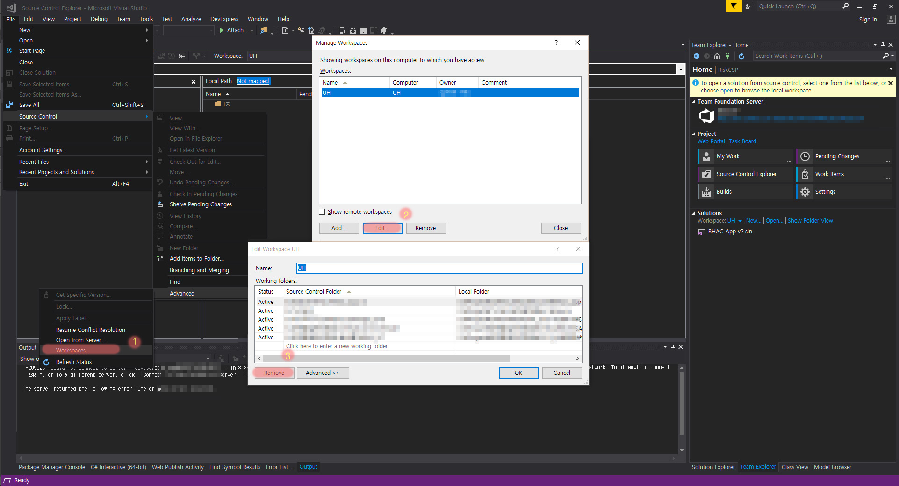
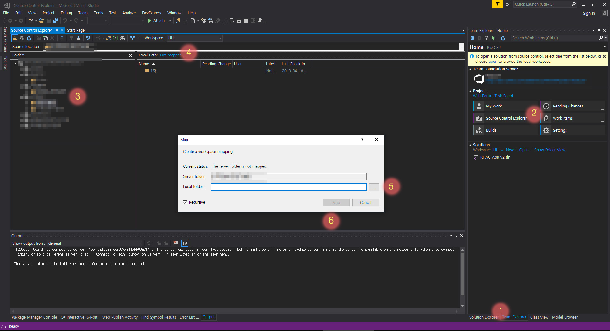
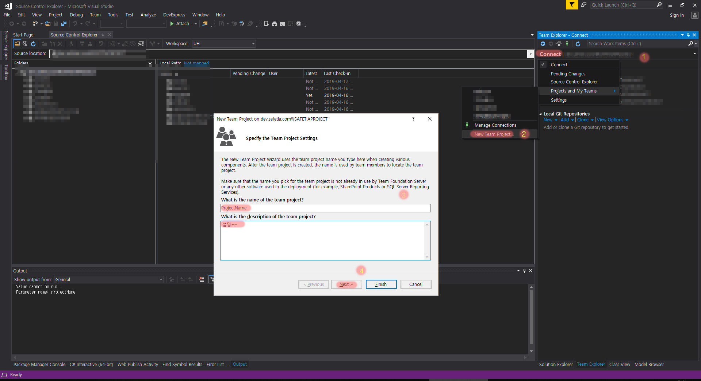
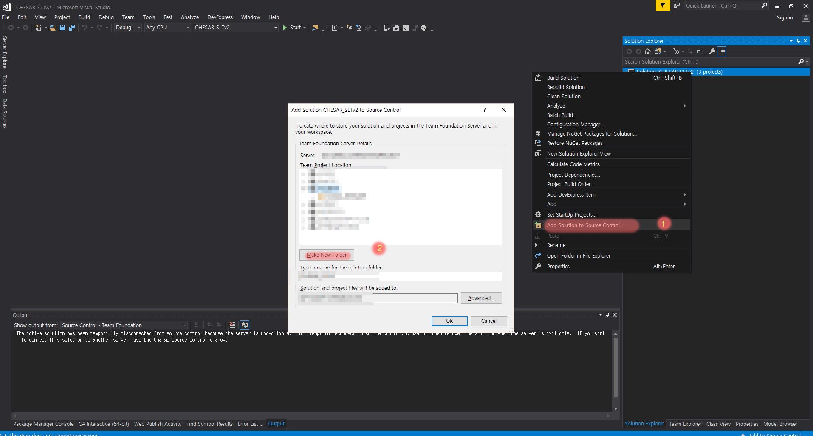
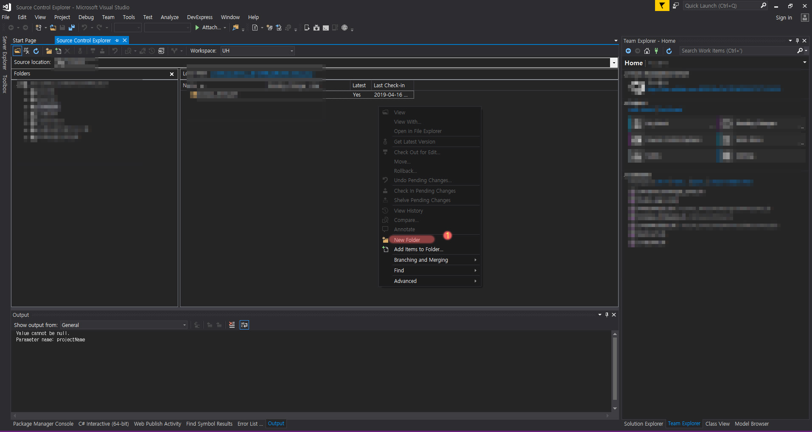
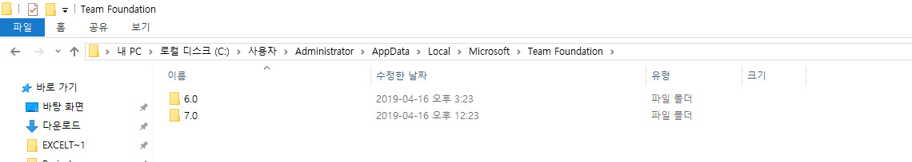
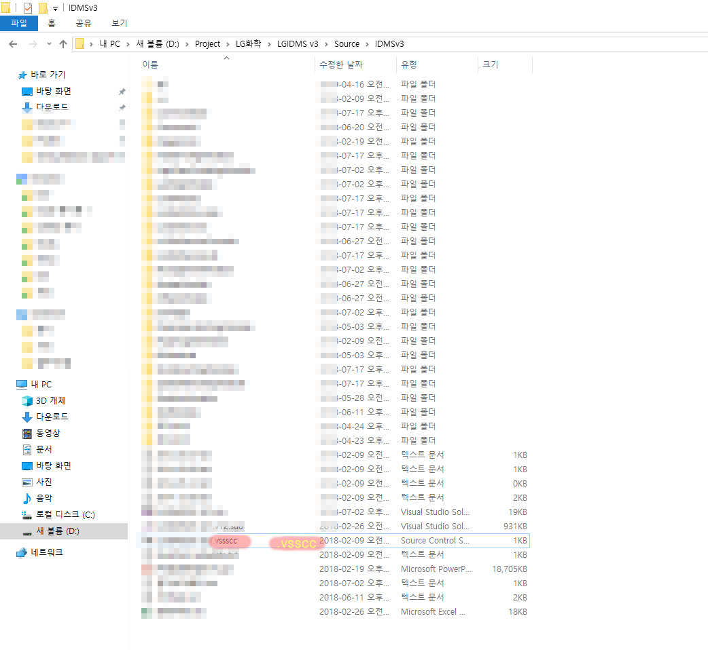

# TFS - visual Studio 환경 및 사용법 (Team Foundation Server)

## 목차
1. :email: Version [link](#Version)
1. :email: Visual Studio Connect [link](#VisualStudioConnect)
    1. :email: remove WorkSpace (작업영역 삭제) [link](#RemoveWorkSpace)
    1. :email: mapping WorkSpace (작업영역 추가) | git Clone[link](#MappingWorkSpace)
    1. :email: add Group Directory [link](#AddGroupDirectory)
    1. :email: add Directory [link](#AddDirectory)
1. :email: Visual Studio Dispose Connect [link](#VisualStudioDisposeConnect)
    1. :email: Delete FTS Cache Data (캐시삭제)[link](#MailService)
    1. :email: project FTS Dipose (프로젝트 연결해제)[link](#MailService)
    
1. :email: TFS Branch [link](#DeleteFTSCacheData)
    1. :email: project FTS Cache Data (프로젝트 연결해제)[link](#projectFTSDipose)

 
 

### Version
> 사용 버전 

`visual Studio 2013 | 2015 | 2017 | 2019`

`Team Foundation Server 2013 | 2015 | 2019 DevObs`

 
 

### Visual Studio Connect

#### Remove WorkSpace 

`[file] - [source control] - [advanced] - [workSpcae] -[해당계정 선택] -[Edit] - [해당프로젝트 삭제]`

#### Mapping WorkSpace (작업영역 추가) 

`Visual Studio에 TFS연결후에 [team Explorer] - [Source Control Explorer] - [해당디렉토리로 이동] - [LocalPath 클릭] - [로컬 디렉토리 연결] - [Map]`

#### Add Group Directory 

`Visual Studio에 TFS연결후에 [team Explorer] - [connect 오른쪽클릭] - [projects and my  Teams] - [New Team Project] - [Proejct 명 , Description 입력] -[다음 다음 다음 다음]`

#### Add Directory 

> Mapping안된 디렉토리

`Visual Studio에 TFS연결후에 [solution 오른쪽클릭] - [add soultion - to Source control] - [Make New Folder] - [OK] `

맵핑되지 않은 Workspace의 디렉토리추가는 맵핑후에 혹은 맵핑진행 과정에 가능하다.

> Mapping 된 디렉토리 추가

`Visual Studio에 TFS연결후에 [team Explorer] - [Source Control Explorer] - [해당 디렉토리 이동] - [마우스 오른쪽] - [new Folder] `

 
 

### Visual Studio Dispose Connect

#### Delete FTS Cache Data (캐시삭제)[link](#MailService)

FTS 이력이 AppData - TFS - 파일에 쌓인다 가서 해당 캐시를 삭제해주자!  (기존 연결이 해제되진 않으니 걱정 ㄴㄴ)

`c:\사용자\계정\AppData\Local\Microsoft\TeamFoundation\ - 안에있는 폴더 모두 삭제`

#### project FTS Dipose (프로젝트 연결해제)[link](#MailService)

`soultion Directory - .vsscc 삭제`

